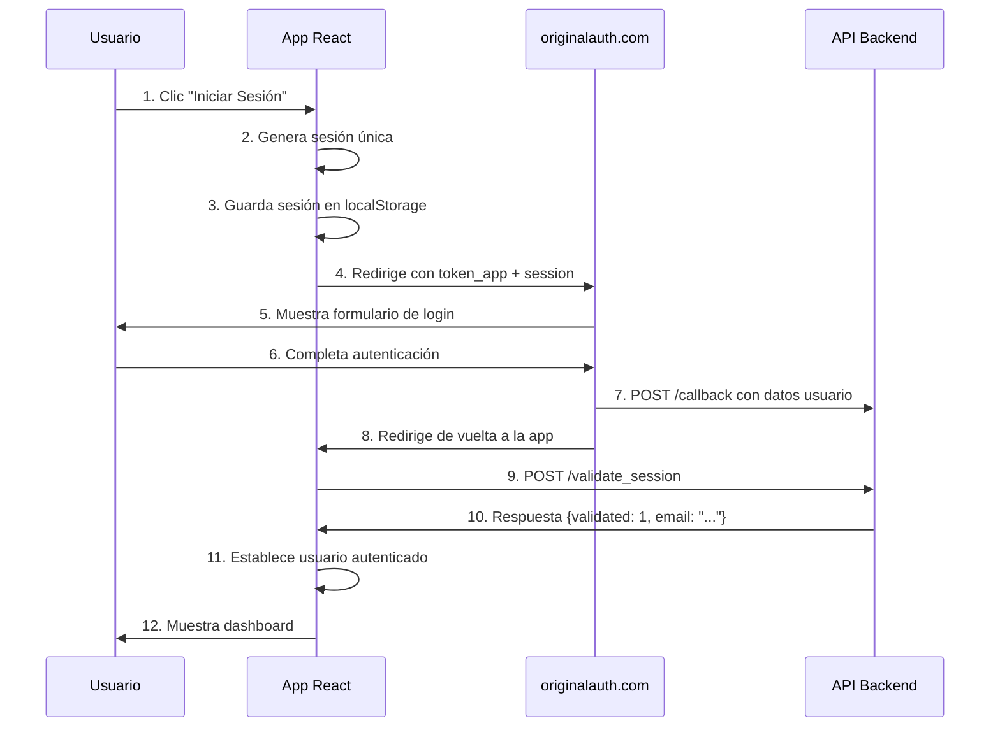

# 🔐 Auth Web App

Ejemplo de sistema de autenticación seguro usando sesiones únicas temporales y integración con APIs externas. El proyecto demuestra un flujo completo de autenticación con **originalauth.com** y manejo de sesiones en tiempo real.


## 🌟 Características Principales

- ✅ **Autenticación Externa**: Integración completa con originalauth.com
- ✅ **Sesiones Únicas**: Generación de sesiones temporales con timestamp + random
- ✅ **Context API**: Manejo global del estado de autenticación
- ✅ **Rutas Protegidas**: Sistema de protección de componentes
- ✅ **Persistencia Local**: Manejo de sesiones en localStorage
- ✅ **Validación en Tiempo Real**: Verificación automática de sesiones
- ✅ **Múltiples Pestañas**: Sincronización entre pestañas del navegador
- ✅ **Diseño Responsive**: Interfaz moderna con Tailwind CSS
- ✅ **Manejo de Errores**: Sistema robusto de error handling
- ✅ **Logging Detallado**: Debug completo del flujo de autenticación

## 🏗️ Arquitectura del Sistema

### **Flujo de Autenticación Completo**



### **Componentes Principales**

```
┌─ AuthProvider ──────────────────────────┐
│  ├─ AuthContext (Estado Global)         │
│  ├─ useAuth Hook (Acceso al contexto)   │
│  └─ Session Management                   │
└─ App ──────────────────────────────────┐│
   ├─ AppContent                         ││
   │  ├─ HomePage (No autenticado)       ││
   │  └─ ProtectedRoute                  ││
   │     └─ DashboardPage (Autenticado)  ││
   └─ Navigation (Adaptativa)            ││
└─────────────────────────────────────────┘│
└──────────────────────────────────────────┘
```

## 🚀 Instalación y Configuración

### **Prerrequisitos**
- Node.js 16+ 
- npm o yarn
- Acceso a originalauth.com configurado

### **Instalación**

```bash
# 1. Clonar el repositorio
git clone https://github.com/tu-usuario/auth-web-app.git
cd auth-web-app

# 2. Instalar dependencias
npm install

# 3. Instalar Tailwind CSS
npm install -D tailwindcss postcss autoprefixer
npx tailwindcss init -p

# 4. Configurar Tailwind (ver sección de configuración)

# 5. Ejecutar la aplicación
npm start
```

### **Configuración de Tailwind CSS**

**tailwind.config.js:**
```javascript
module.exports = {
  content: ["./src/**/*.{js,jsx,ts,tsx}"],
  theme: {
    extend: {},
  },
  plugins: [],
}
```

**src/index.css:**
```css
@tailwind base;
@tailwind components;
@tailwind utilities;
```

### **Variables de Entorno**

Crea un archivo `.env` en la raíz del proyecto:

```env
REACT_APP_API_BASE_URL=https://theoriginallab-api-automatizacionestol-prod.m0oqwu.easypanel.host
REACT_APP_API_KEY=lety
REACT_APP_APP_TOKEN=csbjsN9jvhrhNWYEU0Uc
REACT_APP_SECRET_KEY=5ZcaBXG4P3fImUskQpBC
REACT_APP_LOGIN_API_URL=https://originalauth.com/login
```

## ⚙️ Configuración de APIs

### **Configuración Principal** (`src/config/app.js`)

```javascript
export const APP_CONFIG = {
  // URL de tu API backend
  API_BASE_URL: 'https://tu-api.com',
  
  // API Key para autenticación
  API_KEY: 'lety',
  
  // Token de tu aplicación registrada
  APP_TOKEN: 'csbjsN9jvhrhNWYEU0Uc',
  
  // Clave secreta
  SECRET_KEY: '5ZcaBXG4P3fImUskQpBC',
  
  // URL del sistema de login externo
  LOGIN_API_URL: 'https://originalauth.com/login',
  
  // Endpoints de tu API
  ENDPOINTS: {
    CALLBACK: '/callback',
    VALIDATE_SESSION: '/validate_session'
  }
};
```

### **Endpoints Requeridos en tu Backend**

#### **POST /callback**
Recibe datos del login externo:
```json
{
  "session": "1750267856255_eeceffiadlb",
  "token_app": "csbjsN9jvhrhNWYEU0Uc", 
  "secret_key": "5ZcaBXG4P3fImUskQpBC",
  "email": "usuario@ejemplo.com",
  "name": "Usuario Demo",
  "phone": "6184654546",
  "profile_img": "https://..."
}
```

#### **POST /validate_session**
Valida sesión activa:
```json
// Request
{
  "session": "1750267856255_eeceffiadlb"
}

// Response
{
  "validated": 1,
  "email": "usuario@ejemplo.com"
}
```

## 🔄 Flujos de la Aplicación

### **1. Flujo de Login**

1. **Inicio**: Usuario en HomePage ve botón "Iniciar Sesión"
2. **Generación**: Se crea sesión única `${timestamp}_${randomString}`
3. **Almacenamiento**: Sesión se guarda en `localStorage`
4. **Redirección**: Usuario va a `originalauth.com/login?token_app=TOKEN&session=SESSION`
5. **Autenticación**: Usuario completa login en originalauth.com
6. **Callback**: originalauth.com llama a `/callback` con datos del usuario
7. **Regreso**: Usuario regresa a la aplicación
8. **Validación**: App llama a `/validate_session` con la sesión
9. **Éxito**: Si válida, se muestra el dashboard autenticado

### **2. Flujo de Validación**

```javascript
// La aplicación verifica automáticamente:
const response = await validateSessionAPI(session);

if (response.validated === 1) {
  // Usuario autenticado ✅
  setUser({
    email: response.email,
    name: response.email.split('@')[0],
    session: session,
    validated: response.validated
  });
  setIsAuthenticated(true);
} else {
  // Sesión inválida ❌
  removeSession();
  setIsAuthenticated(false);
}
```

### **3. Flujo de Logout**

1. **Acción**: Usuario hace clic en "Cerrar Sesión"
2. **Confirmación**: Se muestra diálogo de confirmación
3. **Limpieza**: Se elimina sesión de `localStorage`
4. **Estado**: Se resetea estado de autenticación
5. **Redirección**: Se muestra HomePage

## 📁 Estructura del Proyecto

```
auth-web-app/
├── public/
│   ├── index.html
│   └── favicon.ico
├── src/
│   ├── components/
│   │   ├── Navigation/
│   │   │   ├── Navigation.jsx
│   │   │   └── index.js
│   │   ├── ProtectedRoute/
│   │   │   ├── ProtectedRoute.jsx
│   │   │   └── index.js
│   │   └── index.js
│   ├── contexts/
│   │   ├── AuthContext.js          # Definición del contexto
│   │   └── index.js
│   ├── providers/
│   │   ├── AuthProvider.jsx        # Lógica principal de auth
│   │   └── index.js
│   ├── pages/
│   │   ├── HomePage/
│   │   │   ├── HomePage.jsx        # Página de inicio
│   │   │   └── index.js
│   │   ├── DashboardPage/
│   │   │   ├── DashboardPage.jsx   # Dashboard autenticado
│   │   │   └── index.js
│   │   └── index.js
│   ├── utils/
│   │   ├── api.js                  # Funciones de API
│   │   ├── session.js              # Manejo de sesiones
│   │   └── index.js
│   ├── config/
│   │   ├── app.js                  # Configuración general
│   │   └── index.js
│   ├── hooks/
│   │   ├── useAuth.js              # Hook personalizado
│   │   └── index.js
│   ├── App.jsx                     # Componente principal
│   ├── index.js                    # Punto de entrada
│   └── index.css                   # Estilos con Tailwind
├── package.json
├── tailwind.config.js
├── postcss.config.js
└── README.md
```

## 🧩 Componentes Clave

### **AuthProvider** (`src/providers/AuthProvider.jsx`)
- Maneja todo el estado de autenticación
- Proporciona métodos: `preLogin()`, `validateSession()`, `logout()`
- Gestiona persistencia en `localStorage`
- Sincroniza estado entre múltiples pestañas

### **useAuth Hook** (`src/hooks/useAuth.js`)
```javascript
const { 
  user,              // Datos del usuario autenticado
  isLoading,         // Estado de carga
  isAuthenticated,   // Estado de autenticación
  isRedirecting,     // Estado de redirección
  preLogin,          // Función para iniciar login
  validateSession,   // Función para validar sesión
  logout             // Función para cerrar sesión
} = useAuth();
```

### **ProtectedRoute** (`src/components/ProtectedRoute/ProtectedRoute.jsx`)
```javascript
<ProtectedRoute fallback={<HomePage />}>
  <DashboardPage />
</ProtectedRoute>
```

## 🔧 Utilidades

### **Generación de Sesiones** (`src/utils/session.js`)
```javascript
export const generateSession = () => {
  const timestamp = Date.now();
  const random = Math.random().toString(36).substring(2, 15);
  return `${timestamp}_${random}`;
  // Resultado: "1750267856255_eeceffiadlb"
};
```

### **Construcción de URL de Login**
```javascript
export const buildLoginUrl = (session) => {
  const loginUrl = new URL(APP_CONFIG.LOGIN_API_URL);
  loginUrl.searchParams.set('token_app', APP_CONFIG.APP_TOKEN);
  loginUrl.searchParams.set('session', session);
  return loginUrl.toString();
  // Resultado: "https://originalauth.com/login?token_app=TOKEN&session=SESSION"
};
```

### **Llamadas a API** (`src/utils/api.js`)
```javascript
export const apiCall = async (endpoint, data = {}) => {
  const response = await fetch(`${API_BASE_URL}${endpoint}`, {
    method: 'POST',
    headers: {
      'Content-Type': 'application/json',
      'apikey': API_KEY
    },
    body: JSON.stringify(data)
  });
  return await response.json();
};
```

## 🎨 Personalización

### **Estilos y Tema**
- Modifica `tailwind.config.js` para personalizar colores y fuentes
- Estilos adicionales en `src/index.css`
- Componentes usan clases utilitarias de Tailwind

### **Configuración de APIs**
- Actualiza `src/config/app.js` con tus endpoints reales
- Modifica headers y parámetros según tu API
- Ajusta validaciones en `AuthProvider.jsx`

### **Flujo de Usuario**
- Personaliza `HomePage.jsx` para tu marca
- Modifica `DashboardPage.jsx` con funcionalidades específicas
- Agrega nuevas páginas en `src/pages/`

## 🧪 Testing y Debug

### **Logs de Debug**
La aplicación incluye logging detallado:
```javascript
console.log('🔄 Iniciando redirección a originalauth.com');
console.log('Sesión generada:', session);
console.log('URL de redirección:', loginUrl);
console.log('📦 Respuesta de validateSession:', response);
console.log('✅ Usuario autenticado con datos reales:', userData);
```

### **Verificación Manual**
```javascript
// En la consola del navegador:
localStorage.getItem('session');           // Ver sesión actual
window.authState = useAuth();             // Acceder al estado
validateSession();                        // Validar manualmente
```

### **Testing de URLs**
La HomePage incluye botón de debug que muestra la URL construida para testing.

## 🚀 Despliegue en Producción

### **1. Build de Producción**
```bash
npm run build
```

### **2. Variables de Entorno**
- Configura variables reales en tu hosting
- Actualiza URLs de API y originalauth.com
- Verifica configuración de CORS

### **3. Configuración del Servidor**
- Configura endpoints `/callback` y `/validate_session`
- Implementa validación de sesiones
- Configura originalauth.com para hacer callback a tu dominio

### **4. SSL/HTTPS**
- originalauth.com requiere HTTPS para redirecciones
- Configura certificados SSL en producción

## 🔒 Seguridad

### **Mejores Prácticas Implementadas**
- ✅ Sesiones únicas y temporales
- ✅ Validación en servidor
- ✅ Headers de seguridad en API calls
- ✅ Limpieza automática de sesiones inválidas
- ✅ Timeouts en llamadas de API

### **Consideraciones Adicionales**
- Implementar rate limiting en endpoints
- Agregar logs de seguridad en el servidor
- Configurar CSP (Content Security Policy)
- Rotar claves de API regularmente

## 🐛 Troubleshooting

### **Problemas Comunes**

#### **Error: "Element type is invalid"**
```bash
# Verificar exports en componentes
grep -r "export" src/components/
grep -r "export" src/pages/
```

#### **Sesión no se valida**
```javascript
// Verificar respuesta de API
console.log('API Response:', response);
console.log('Validated field:', response?.validated);
```

#### **Redirección no funciona**
```javascript
// Verificar URL construida
const url = buildLoginUrl(generateSession());
console.log('Login URL:', url);
```

#### **Tailwind no se aplica**
```bash
# Verificar configuración
npm list tailwindcss
cat tailwind.config.js
cat src/index.css
```

### **Herramientas de Debug**
- Developer Tools → Network (ver llamadas de API)
- Developer Tools → Application → Local Storage (ver sesiones)
- Developer Tools → Console (ver logs de la aplicación)

## 📊 Monitoreo

### **Métricas Importantes**
- Tiempo de validación de sesiones
- Tasa de éxito de autenticación
- Errores en callbacks
- Sesiones inválidas por tiempo

### **Logging Recomendado**
```javascript
// En producción, enviar a servicio de logging:
logger.info('User login started', { session, timestamp });
logger.info('User authenticated', { email, session });
logger.error('Session validation failed', { session, error });
```

## 🤝 Contribución

### **Desarrollo Local**
1. Fork el repositorio
2. Crea una rama: `git checkout -b feature/nueva-caracteristica`
3. Desarrolla y testea
4. Commit: `git commit -m 'Add: nueva característica'`
5. Push: `git push origin feature/nueva-caracteristica`
6. Abre un Pull Request

### **Estándares de Código**
- Usar ESLint y Prettier
- Seguir convenciones de React
- Documentar funciones complejas
- Incluir tests para nuevas características

## 📝 Changelog

### **v1.0.0** (Actual)
- ✅ Autenticación completa con originalauth.com
- ✅ Manejo de sesiones únicas
- ✅ Context API para estado global
- ✅ Rutas protegidas
- ✅ Diseño responsive con Tailwind
- ✅ Sincronización entre pestañas
- ✅ Logging detallado

### **Próximas Versiones**
- 🔄 Refresh automático de tokens
- 🔄 Soporte para múltiples proveedores
- 🔄 Modo offline
- 🔄 Tests automatizados

## 📄 Licencia

Este proyecto está bajo la Licencia MIT. Ver [LICENSE](LICENSE) para más detalles.

## 🆘 Soporte

### **Documentación**
- [React Documentation](https://reactjs.org/)
- [Tailwind CSS](https://tailwindcss.com/)
- [originalauth.com API](https://originalauth.com/docs)

### **Contacto**
- Issues: [GitHub Issues](https://github.com/tu-usuario/auth-web-app/issues)
- Email: tu-email@ejemplo.com
- Documentación: [Wiki del proyecto](https://github.com/tu-usuario/auth-web-app/wiki)

---

**Desarrollado con ❤️ usando React, Tailwind CSS y originalauth.com**

---

## 📚 Recursos Adicionales

- [Guía de React Context API](https://reactjs.org/docs/context.html)
- [Tailwind CSS Components](https://tailwindui.com/)
- [Mejores Prácticas de Autenticación](https://auth0.com/blog/a-look-at-the-latest-draft-for-oauth-2-security-best-current-practices/)
- [Manejo de Estado en React](https://kentcdodds.com/blog/application-state-management-with-react)

**¡Listo para usar! 🚀**